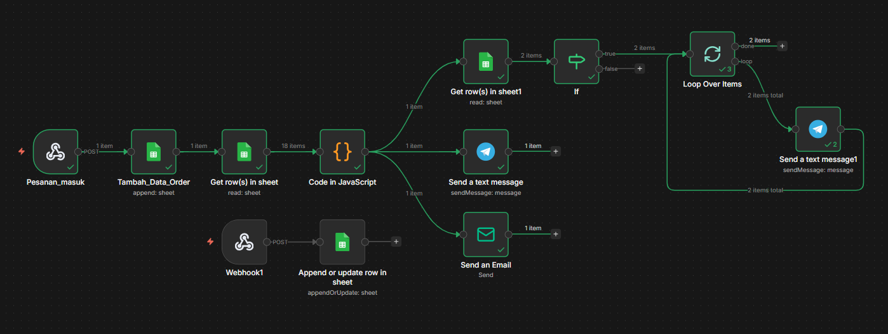

# B2B Supply Chain Automation for Sabana Fried Chicken

An automation prototype designed to eliminate manual, error-prone 
procurement and payment verification processes in F&B franchise operations.

---

## Problem
In F&B franchise operations, branch-to-warehouse procurement is often 
handled manually — from stock requests to payment verification — creating 
delays, human error, and administrative overhead.

## Solution
A 10+ node automated workflow built in n8n that handles the full 
procurement cycle end-to-end.

## Workflow Architecture
1. **Pesanan_masuk** — Branch submits order via form (Tally)
2. **Tambah_Data_Order** — Order automatically logged to Google Sheets
3. **Get row(s) in sheet** — System reads and validates incoming order data
4. **Code in JavaScript** — Business logic: calculates totals, checks stock threshold
5. **Send a text message** — Telegram notification sent to warehouse admin
6. **If** — Conditional check: minimum stock alert trigger
7. **Loop Over Items** — Iterates through ordered items
8. **Get row(s) in sheet** — Retrieves current inventory data
9. **Send a text message** — Alert triggered if stock falls below minimum
10. **Send an Email** — Automated payment verification email dispatched

## Tech Stack
- n8n (workflow automation)
- Google Sheets API
- Telegram API
- Gmail API
- postman (testing form input)
- JavaScript (business logic node)

## How to Use
1. Download `sabana-b2b-supply-chain-automation.json`
2. Open your n8n instance
3. Click **Import** and select the JSON file
4. Configure your own credentials (Google Sheets, Telegram, Gmail)
5. Activate workflow

## Disclaimer
All data shown in this workflow is fictional and used for demonstration 
purposes only. This is an academic prototype and has not been implemented 
by Sabana Fried Chicken.
